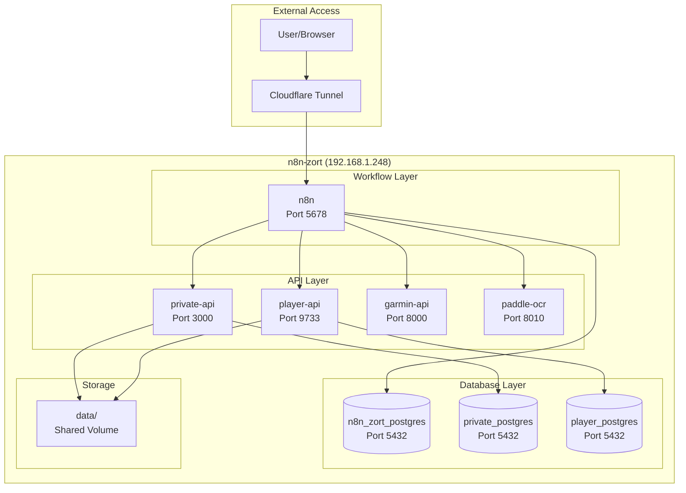

# n8n-zort Architecture

## System Overview



## Data Flow

### 1. ZORT Sales Sync Flow

```
ZORT API → n8n (Scheduled) → private-api → private_postgres
```

### 2. Private Profile Flow

```
User → n8n Webhook → private-api → private_postgres
                    → private-api → data/files
```

### 3. Player Queue Flow

```
n8n Workflow → player-api → player_postgres
```

### 4. Garmin Sync Flow

```
Garmin API → garmin-api → private-api → private_postgres
```

### 5. OCR Processing Flow

```
Image → paddle-ocr → private-api → private_postgres
```

## Port Reference

| Port | Service | Access |
|------|---------|--------|
| 5678 | n8n | Public (Cloudflare) |
| 3000 | private-api | Internal |
| 9733 | player-api | Internal |
| 8000 | garmin-api | Internal |
| 8010 | paddle-ocr | Internal |
| 8080 | adminer | localhost only |
| 5432 | PostgreSQL | Internal |

## Database Schema

### n8n_zort_postgres
- n8n internal tables (workflows, executions, etc.)

### private_postgres
- profiles - User profiles
- files - File metadata
- media - Media metadata

### player_postgres
- queue - Player queue items

## Security Model

```
┌─────────────────────────────────────────────┐
│              Cloudflare Tunnel               │
│  - SSL termination                          │
│  - DDoS protection                          │
│  - Access control                           │
└─────────────────────────────────────────────┘
                    │
┌─────────────────────────────────────────────┐
│              n8n Basic Auth                  │
│  - Username: admin                          │
│  - Password: from .env                      │
└─────────────────────────────────────────────┘
                    │
┌─────────────────────────────────────────────┐
│              API Bearer Tokens               │
│  - PRIVATE_API_TOKEN                        │
│  - LYTB_QUEUE_API_TOKEN                     │
└─────────────────────────────────────────────┘
```

---

_Last updated: 2026-08-26_
